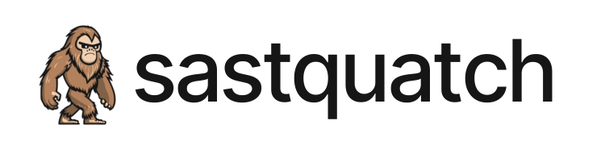
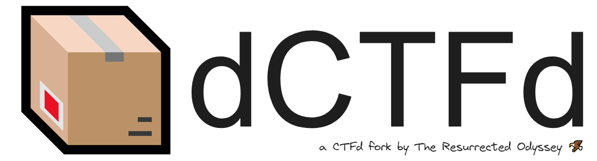

<!----------------------------------------------------------->
<!----------------------------------------------------------->
Hi, I am Ataf (he/him), a CSE graduate from [Department of CSE, BUET](https://cse.buet.ac.bd/). My key interests lie in the fields of **software, systems, and network security**. Currently, I'm looking for PhD supervisors for Fall 2025 semester.

My career goal is to pursue a PhD in my field of interests. I'm working with [Prof. Anindya Iqbal](https://cse.buet.ac.bd/faculty/faculty_detail/anindyaiqbal) and [Prof. Gias Uddin](https://giasuddin.ca/) on a project regarding **the effectiveness of static analysis tools in detecting vulnerabilities**. 

I work as a Software Security Engineer at [OpenRefactory](https://www.openrefactory.com/). An important part of my work is OpenSSF's Project [Alpha-Omega](https://alpha-omega.dev/) where we [**find and fix vulnerabilities in popular open source projects**](https://openssf.org/blog/2023/12/05/finding-and-fixing-bugs-in-open-source-software-at-scale-with-a-grant-from-alpha-omega/).

During my undergraduate life, I participated in different competitions- CTF, hackathons, etc. [My team once became third in Bangladesh National Cyber Drill competition](https://digibanglatech.news/english/91288/). I enjoy contributing to open source projects. I have contributed to popular projects such as- [**dapr**](https://github.com/dapr/dapr/pull/7381), [**kubernetes**](https://github.com/kubernetes/kubeadm/pull/2983), [**google bigquery python**](https://github.com/googleapis/python-bigquery-dataframes/pull/258), [**web3.py**](https://github.com/ethereum/web3.py/pull/3080), [**django-helpdesk**](https://github.com/django-helpdesk/django-helpdesk/pull/1120/files), etc. [I have **60+ merged pull requests** on GitHub](https://docs.google.com/spreadsheets/d/1BhXlbzaMkDmWduV4PjRDu-BWO8mMlE3szC8ef0PWiZM/).

I'm an ***adaptive learner* and a *hard working*** person. I have prior *leadership experience* in academic projects and extra-curricular areas. As a team player, I do my best and over to fulfill the responsibilities given to me. I truly believe that having **clear communication** among a group is most vital for its success.

<!----------------------------------------------------------->
<!----------------------------------------------------------->
---
## Education
### Bachelor of Science, Computer Science & Engineering
#### Bangladesh University of Engineering & Technology
April 2018 - May 2023

**CGPA: 3.50 out of 4.00** (Final Year: 3.75)

Notable Courses:
- CSE 405 - Computer Security
- CSE 471 - Machine Learning
- CSE 461 - Algorithm Engineering
- CSE 423 - Fault Tolerant Systems
- CSE 321 - Computer Networks
- CSE 313 - Operating Systems

### Higher Secondary Certificate
#### Notre Dame College, Dhaka
June 2015 - May 2017

**GPA: 5.00 out of 5.00 (Talentpool Scholarship)**

<!----------------------------------------------------------->
<!----------------------------------------------------------->
---
## Research
### Interaction and NLP Based Sentiment Analysis of Bangla Food Review in Social Media
#### Undergraduate Thesis 
Supervisor: [Dr. Sadia Sharmin (BUET)](https://cse.buet.ac.bd/faculty/faculty_detail/sadia)

[GitHub](https://github.com/fazledyn/undergraduate-thesis) | [Draft Paper](https://docs.fazledyn.com/archive/Draft_ASONAM2023_Facebook_Bangla_Food_Review_Paper.pdf) | [Thesis Book](https://github.com/fazledyn/undergraduate-thesis/blob/d5974e5954aeb8694a610e96700a40599d3c5f18/thesis-book/Interaction%20and%20Natural%20Language%20Processing%20Based%20Sentiment%20Analysis%20of%20Bangla%20Food%20Review%20in%20Social%20Media%20-%20UG%20Thesis.pdf)

In this study, we collected data from different Facebook pages to analyze the sentiment of social media users regarding food review. For this, we used reactions and comments to analyze the sentiment in two independent ways. This work was submitted to ASONAM 2023.

### Devising A Low-Cost and Portable System for Remotely Monitoring Water Quality in Real-Time
#### CSE316: Microprocessor, Microcontroller, and Embedded Systems Project 
Supervisor: [Dr. A.B.M. Alim Al Islam (BUET)](https://cse.buet.ac.bd/faculty/faculty_detail/razi)

[GitHub](https://github.com/fazledyn/supply-water-quality-monitoring-system) | [Draft Paper](https://docs.fazledyn.com/archive/Draft_NSysS2021_Devising_A_Low_Cost_and_Portable_System_for_Remotely_Monitoring_Water_Quality_in_Real_Time.pdf)

Based on our microcontroller project, we wrote a conference paper for our device and its capability to remotely monitor water quality as a cost-effective solution. This work was submitted to NSysS 2021, however it was rejected due to lack of novelty.

<!----------------------------------------------------------->
<!----------------------------------------------------------->
---
## Projects
### Sastquatch
<table style="font-size: 1rem">
    <tr>
        <td width="50%">
            
        </td>
        <td width="50%" style="vertical-align: middle">
            <ul>
                <li>Personal Project</li>
                <li>Static analysis tool based on CodeQL & Semgrep</li>
                <li>Contains more than 50+ custom rules</li>
                <li>Web-based UI to check the scan results (WIP)</li>
                <li>
                    <a href="https://github.com/fazledyn/sastquatch" target="_blank">
                        Source Code
                    </a>
                </li>
            </ul>
        </td>
    </tr>
</table>

### Project Alpha Omega by OpenSSF
<table style="font-size: 1rem">
    <tr>
        <td width="50%">
            
        </td>
        <td width="50%" style="vertical-align: middle">
            <ul>
                <li>Find & fix vulnerabilities in top open source GitHub projects</li>
                <li>Create patches for the bugs, share with maintainers</li>
                <li>Create POC to demonstrate the vulnerabilties</li>
                <li>Submit patches through PR, PVR, or email</li>
                <li>
                    <a href="https://openssf.org/blog/2023/12/05/finding-and-fixing-bugs-in-open-source-software-at-scale-with-a-grant-from-alpha-omega/" target="_blank">Blog Post</a>,
                    <a href="https://docs.google.com/spreadsheets/d/1K8dc6SrSEoqqh46cFisZM1tiN4CigaXsqkCKfCM8UTs/" target="_blank">Google Sheet</a>
                </li>
            </ul>
        </td>
    </tr>
</table>

<!-- ### The Clean Beach Project
<table style="font-size: 1rem">
    <tr>
        <td width="50%">
            
        </td>
        <td width="50%" style="vertical-align: middle">
            <ul>
                <li>Ongoing project at OpenRefactory</li>
                <li>Working as a Project Lead</li>
                <li>Focused on supply chain security of popular open source libraries</li>
                <li>Collaborating with <b>Apache Airflow</b>, <b>Jenkins</b> library maintainers</li>
                <li>
                    <a href="https://osseu2024.sched.com/event/15e510f6f79d7d5cc06c769bd5769c66" target="_blank">
                        Recent Talk at Open Source Summit
                    </a>
                </li>
            </ul>
        </td>
    </tr>
</table> -->

### Convolutional Neural Network Model from Scratch
<table style="font-size: 1rem">
    <tr>
        <td width="50%">
            
        </td>
        <td width="50%" style="vertical-align: middle">
            <ul>
                <li>Implemented a CNN model from scratch</li>
                <li>Developed using numpy only</li>
                <li>Used the model to detect Bangla Characters</li>
                <li>
                    <a href="https://github.com/fazledyn/L4T2/tree/master/CSE472-ML/offline4-cnn" target="_blank">
                        Source Code
                    </a>
                </li>
            </ul>
        </td>
    </tr>
</table>

### dCTFd
<table style="font-size: 1rem">
    <tr>
        <td width="50%">
            
        </td>
        <td width="50%" style="vertical-align: middle">
            <ul>
                <li>A fork of popular CTF hosting platform called <b>CTFd</b></li>
                <li>Developed it for organizing a CTF competition</li>
                <li>Additional features such as <b>TLS/SSL</b> certificate support for databases, <b>s3 support</b> for other cloud providers</li>
                <li>Updated scripts for database and s3 connections testing</li>
                <li>
                    <a href="https://theresurrectedodyssey.medium.com/creating-a-scalable-ctf-infrastructure-on-digitalocean-90dfe1d38988" target="_blank">
                        Blog Post
                    </a>,
                    <a href="https://github.com/fazledyn/dCTFd" target="_blank">
                        Source Code
                    </a>
                </li>
            </ul>
        </td>
    </tr>
</table>

### Gender Classification from Audio Clips 
<table style="font-size: 1rem">
    <tr>
        <td width="50%">
            
        </td>
        <td width="50%" style="vertical-align: middle">
            <ul>
                <li>CSE 472 Machine Learning Project</li>
                <li>Deep learning model capable of identifying the gender of a person from voice</li>
                <li>Trained on two large datasets (Mozilla Common Voice, Bengali Common Voice Speech)</li>
                <li>Developed using Tensorflow, Keras</li>
                <li>
                    <a href="https://docs.google.com/presentation/d/14BWOq6YSmO3GqZHEvCou43Z5A4dlOmKq4pjqUqgZALU/" target="_blank">
                        Slides
                    </a>,
                    <a href="https://github.com/fazledyn/gender-classification-from-audio-clips" target="_blank">
                        Source Code
                    </a>
                </li>
            </ul>
        </td>
    </tr>
</table>

### EventFly: A Web-based Event Management Tool
<table style="font-size: 1rem">
    <tr>
        <td width="50%">
            
        </td>
        <td width="50%" style="vertical-align: middle">
            <ul>
                <li>CSE 408 Software Engineering Project</li>
                <li>Online event management tool for hosting events</li>
                <li>Developed using a microservice based architecture</li>
                <li>Combined group project</li>
                <li>
                    <a href="https://docs.google.com/presentation/d/1F7u2Gd58l1ELqF-vthFWd2ZWTiked1lhL3o7uOlDPf0/" target="_blank">
                        Slides
                    </a>,
                    <a href="https://github.com/orgs/eventfly/repositories" target="_blank">
                        Source Code
                    </a>
                </li>
            </ul>
        </td>
    </tr>
</table>

### Cycloan: A Real-time Cycle Sharing Platform
<table style="font-size: 1rem">
    <tr>
        <td width="50%">
            
        </td>
        <td width="50%" style="vertical-align: middle">
            <ul>
                <li>CSE 216 Database Project</li>
                <li>Online cycle sharing platform</li>
                <li>Backend queries completely written in raw SQL</li>
                <li>Real time location sharing using Google Maps</li>
                <li>
                    <a href="https://youtu.be/5lOaXUqJ86M" target="_blank">
                        Presentation Video
                    </a>,
                    <a href="https://github.com/fazledyn/cycloan" target="_blank">
                        Source Code
                    </a>
                </li>
            </ul>
        </td>
    </tr>
</table>

<!----------------------------------------------------------->
<!----------------------------------------------------------->
---
## Work
### Software Security Engineer
#### [OpenRefactory Inc.](https://openrefactory.com/)
July 2023 - Present (Full Time)

### Fullstack Web Developer
#### [Mindshare Bangladesh](https://mindshare-bd.com/)
June 2021 - Nov 2021 (Contractual)

<!----------------------------------------------------------->
<!----------------------------------------------------------->
---
## Skills
### Programming Languages, Frameworks, Databases
- `Python`, `JavaScript`, `C/C++`, `Java`, `Go`
- `ExpressJS`, `Django`, `Flask`, `React`, `NextJS`
- `PostgreSQL`, `MongoDB`, `MySQL`, `OracleDB`

### Development & Other Tools
- `Git`, `Bash`, `Docker`, `Jenkins`, `NGINX`

### Security Tools
- `BurpSuite`, `Wireshark`, `Nmap`
- `dnSpy`, `Ghidra`
- `gobuster`, `dirb`
- `CodeQL`, `Semgrep`

### Machine Learning Libraries
- `Tensorflow`, `PyTorch`, `Keras`

<!----------------------------------------------------------->
<!----------------------------------------------------------->
---
## Extracurricular
### President
#### [BUET Entrepreneurship Development Club](https://www.facebook.com/BUET.EDC/)
May 2022 - May 2023

### Vice-President, Co-Founder
#### [BUET Cyber Security Club](https://buetsec.github.io/)
Nov 2022 - May 2023

### Coordinator, Media & Events
#### [BSADD - BUET System Analysis, Design and Development community](https://bsadd.github.io/)
June 2020 - May 2023

<!----------------------------------------------------------->
<!----------------------------------------------------------->
---
## Achievements
- [Achieved 3rd position in National Cyber Drill 2022 as team **BUET Fsociety**](https://www.cirt.gov.bd/wp-content/uploads/2022/12/Press-Release-NCD-2022.pdf) | [**News Link**](https://digibanglatech.news/english/91288/)

- Achieved 13th position in University Cyber Drill 2022 as team **BUET Fsociety**		

- Achieved 6th position in National Cyber Drill 2021 as team **Knight Squad** 

- [Received a Military Appreciation Coin from the **US Embassy Dhaka**](https://www.facebook.com/BUET.EDC/posts/pfbid0M45Cn7VBXb6JhhJvxdJ3XSigtW8gJHyg1LYZFQsQJLMHgBD3X7cKnDnVXXWDnjy5l)

<!----------------------------------------------------------->
<!----------------------------------------------------------->
---
## CV
My latest CV can be found [here](https://docs.google.com/document/d/1VfoVqina0UtBzSfK218HsiEqn0fAwdgcMastUvAB5i4/edit?usp=sharing).
